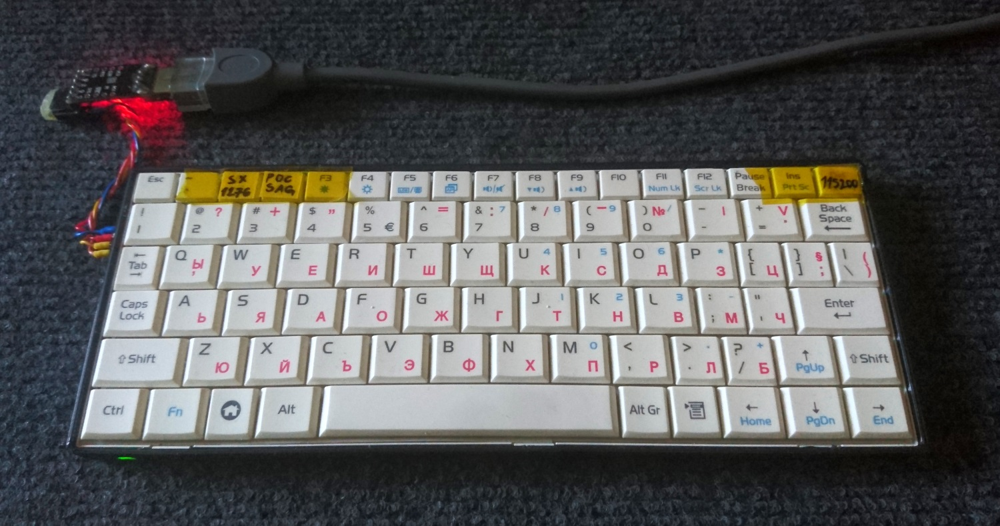
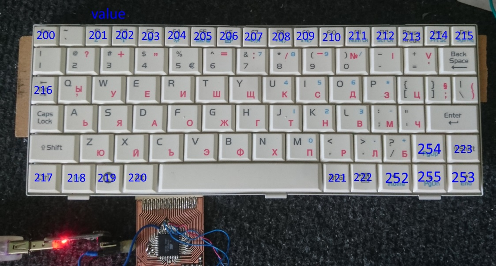
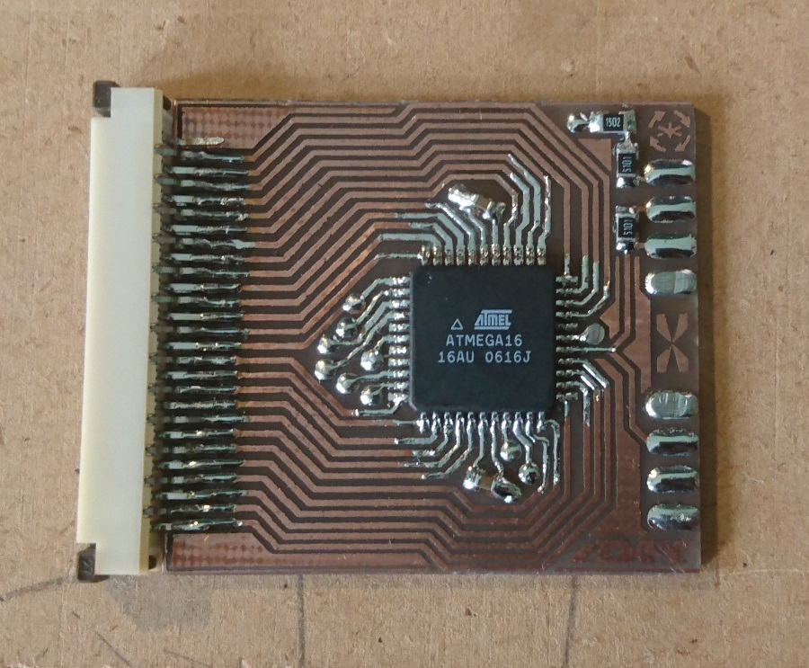
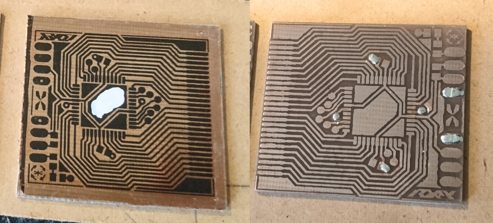
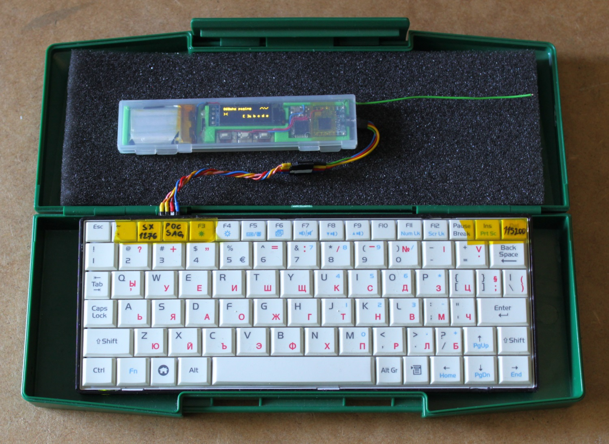
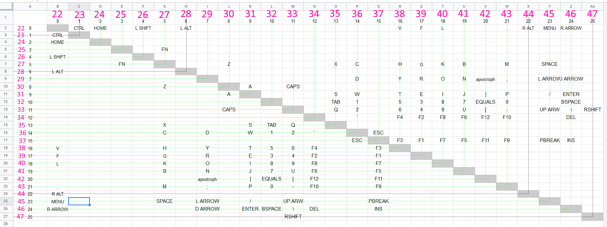

# ATmega16 serial keyboard

## Features

 - Key macros can be added in code
 
 - Caps toggle with LED indication
 
 - Select 115200 serial baud rate at power up (9600 default)
 
 - Send values outside ASCII range with non letter keys
 
 - Works with laptop mini keyboards 26-pin (28-pin with 2 being a short)

## Operation

When powering up, while the LED is lit, you can choose either: 9600 baud by not pressing DEL or 115200 by pressing DEL. After that you can choose a macro key mapping preset with F1 - F12. Finally when the LED is off you can start typing.

Toggling caps lock is done by a single press on the caps key. Shift key inverts it. When caps is on, the numbers change into symbols too.

_When designing an application at the other end of the serial cable, you may consider to take advantage of the non letter keys that send values (>200), as interface navigation. For example: ESC to exit out of options, HOME to exit out to start screen, ENTER to send a message or save an option, arrow keys for navigating through options and F1 - F12 for predefined functions._

# Hardware

Can be made with ATmega16/164/32/324/644/1284/8535 (44pin TQFP packege).

For 115200 serial baud rate a 16Mhz or a different suitable crystal is required, even though it's not included in the board design.
Board is designed for single side etching with some wire jumpers. Feel free to improve it.

There are pads left on the PCB for ISP programming.

  
_values that can be sent from the corresponding keys_

  
_assembled board only with components, no jumper wires or crystal_

_< toner layer to protect copper from etchant | etched pcb >_

  
_serial keyboard connected to a RFM95 LoRa communicator_

_keyboard ribbon cable pin multiplexing mapping_

# Programming

 - Download and install [MightyCore](https://github.com/MCUdude/MightyCore)
 
 - Open code in IDE of choice
 
 - Configure board settings
 
   - Select your MCU and crystal frequency
   
   - Leave the rest of the board settings by default
   
 - If want, you can enable bootloader and leave out a reset pin on the serial connector for future configuring of the key macros.
   
 - Flash via ISP programmer and it's done.
